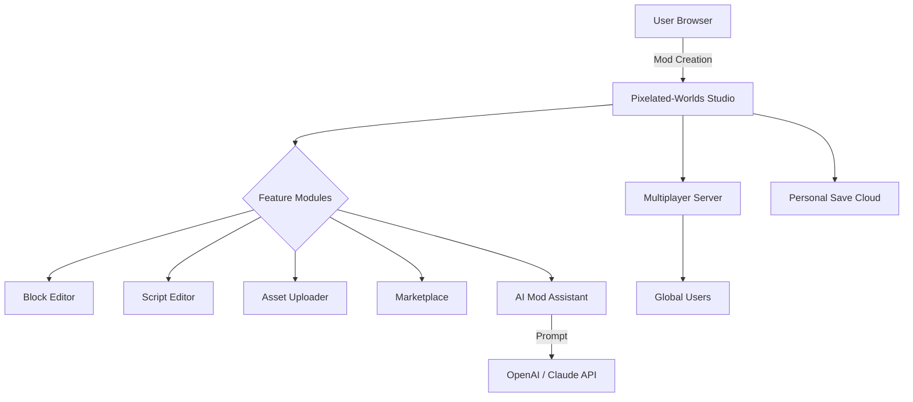

# Pixelated-Worlds: The Browser-Based Minecraft MOD Studio 🧩🌍

> Build, customize, and play uniquely crafted Minecraft mods—all within your browser!
>
> Pixelated-Worlds is a cutting-edge, community-powered studio that brings Minecraft modding and multiplayer sandbox building to the web. Experiment with advanced modding tools, connect with others, and deploy your creations seamlessly. iOS supported and cross-device ready. Maintenance updates only.

---

## 🚀 Table of Contents

1. [Project Vision](#project-vision-🚦)
2. [Key Features](#key-features-🔑)
3. [Interactive Showcase (Mermaid Diagram)](#interactive-showcase-mermaid-diagram-🎨)
4. [Feature List](#feature-list-📋)
5. [Example Profile Configuration](#example-profile-configuration-📝)
6. [Example Console Invocation](#example-console-invocation-🖥️)
7. [OS Compatibility Matrix](#os-compatibility-matrix-💻)
8. [OpenAI & Claude API Integration](#openai--claude-api-integration-🤖)
9. [Multilingual and Responsive UI](#multilingual-and-responsive-ui-🌐)
10. [24/7 Community Support](#247-community-support-🕐)
11. [Download & Installation](#download--installation-⬇️)
12. [Disclaimer](#disclaimer-⚠️)
13. [License](#license-📝)

---

## Project Vision 🚦

**Pixelated-Worlds** is more than a game; it's a symphony of innovation, where creativity dances at your fingertips. Forget the boundaries of traditional modding setups—the browser *is* your world now. Transform texture packs, share custom mobs, simulate new dimensions, and collaborate in multiplayer sandbox realms, all from iOS, Android, desktop, or VR-headset browsers.

**Keywords:**  
*Minecraft modding studio*, *online Minecraft mod builder*, *cross-platform Minecraft mods*, *browser-based Minecraft clone*, *multiplayer mod development*, *in-browser voxel editor*, *AI Minecraft mod generator*, *Minecraft iOS online*.

---

## Key Features 🔑

- **True In-Browser Modding:** Drag, drop, code, and test Minecraft mods directly in your web browser.
- **Real-Time Multiplayer Sandbox:** Host or join collaborative mod  worlds—see others' creations update live.
- **AI Assistant Integration:** Use OpenAI & Claude prompts to generate in-game scripts, dialogue, or lore.
- **Fully Responsive UI:** Pixel-perfect on iOS, Android, laptops, tablets, and large displays.
- **Comprehensive Modding Toolkit:** Visual block-based and raw-code editors for gameplay tweaks, advanced mob behaviors, and custom blocks.
- **Multilingual Support:** Interface and tutorials in English, Español, Français, 中文, Deutsch, and more!
- **24/7 Community Support:** Get live help, tips, and peer reviews at any hour.
- **Mod Marketplace (Beta):** Share, discover, and remix mods from the community.
- **Extraordinary Compatibility:** Play solo, connect with friends, or collaborate with AI NPCs across all modern browsers.

---

## Interactive Showcase (Mermaid Diagram) 🎨

See how Pixelated-Worlds' ecosystem connects you, AI, and the community:

---

## Feature List 📋

- Intuitive block-logic creators and code auto-complete.
- Seamless texture, sound, and asset management.
- OpenAI & Claude prompt fields for automatic quest/mechanic/script generation.
- Multiplayer split/world-sharing and live mod-coding collaboration.
- In-browser pixel and voxel art tools.
- AI-powered mob and NPC generator.
- Mod export for desktop Java/Bedrock editions (experimental).
- Robust permission system for collaborative modding.
- Customizable UI themes, including dark, light, and retro pixel vibes.
- Rich, SEO-optimized documentation for maximum knowledge share.
- VR interaction (beta), including node-link programming in immersive mode.
- Constantly growing language library and community-voted feature requests!

---

## Example Profile Configuration 📝

Some profile options for personalizing your dev space!

yaml
profile:
  username: "CreeperCreator26"
  preferred_language: "es"
  ui_theme: "dark-pixel"
  mod_exports:
    - format: "java"
      filename: "super-rainbows.jar"
  ai_assistant:
    provider: "openai"
    creativity: 0.8
  notifications: true
  multiplayer_visibility: "friends"

---

## Example Console Invocation 🖥️

Here's how you can launch a new collaborative AI-powered mod project with custom settings from the browser console:

js
PixelatedWorlds.startSession({
  projectName: "Epic Sky Realms",
  inviteAI: ["openai", "claude"],
  uiTheme: "retro-pixel",
  language: "fr",
  enableMarketplaceSync: true,
})

---

## OS Compatibility Matrix 💻

| Operating System / Device | Supported Browsers         | Touch Support | VR Mode | Notes         |
|--------------------------|----------------------------|:-------------:|:-------:|--------------|
| Windows 10/11            | Chrome, Edge, Firefox      |     ✔️        |   ✔️    | Full feature  |
| macOS Ventura+           | Safari, Chrome, Firefox    |     ✔️        |   ✔️    | High-Res      |
| iOS 16+                  | Safari, Chrome             |     ✔️        |   ❌    | Mobile-First  |
| Android 11+              | Chrome, Firefox, Edge      |     ✔️        |   ✔️    | Tablet-ready  |
| Linux (Ubuntu 20+)       | Chrome, Firefox            |     ✔️        |   ✔️    | Full feature  |
| VR (Meta Quest 3+)       | Oculus Browser, Firefox XR |     ✔️        |   ✔️    | Experimental  |
| Chromebook               | Chrome                     |     ✔️        |   ✔️    | Classroom use |

---

## OpenAI & Claude API Integration 🤖

Pixelated-Worlds leverages the imaginative prowess of modern AI for creativity without boundaries:

- **Dialogue and Lore Generator:** Craft intricate NPC dialogues and world lore using text completion APIs.
- **Quest Designer:** Pull templates, objectives, and rewards directly from AI prompts.
- **NPC Behavior Scripting:** Describe your ideas in any language; AI translates them into executable mod scripts.
- **Procedural World Descriptions:** AI can help write biome backgrounds or generate captivating title screens.
- **Privacy:** AI integrations are opt-in and run safely in isolated sandboxes.

---

## Multilingual and Responsive UI 🌐

Pixelated-Worlds' interface is not just adaptable—it's a living creature!

- **Language Selection Panel** grows as new translations arrive.
- **Responsive scaling** for devices as small as smart watches or as wide as ultra-wides.
- **Accessible keyboard navigation** and screen reader-friendly structuring.
- **Dynamic tutorial guides** that change based on your device and language.

---

## 24/7 Community Support 🕐

- **Live chat helpdesk** powered by community volunteers and AI moderators.
- **Knowledge base** with rich SEO-optimized entries.
- **Peer review rooms:** Get your modding questions answered by experts or see an AI-generated FAQ.
- **Feedback loop:** Feature requests, bug tracking, and voting, all in-browser.

---

## Download & Installation ⬇️

Start your adventure—it’s not just a download, it’s a launchpad to creativity!  
Pick your device below to get the latest version of Pixelated-Worlds.

---

## Disclaimer ⚠️

Pixelated-Worlds is an original fan-powered platform and **not affiliated with Mojang, Microsoft, or the official Minecraft game**. All mods, assets, and scripting are community-powered and intended for educational, creative, and experimental use only. By using this project, you agree to abide by all community and copyright guidelines. If you wish to use mod exports with commercial versions of Minecraft, please review their respective End User License Agreements.

---

## License 📝

Pixelated-Worlds is distributed under the MIT License © 2026. For full license details, see [LICENSE](./LICENSE).

---

**© 2026 Pixelated-Worlds.**  
Open your browser. Build a world. Push modding boundaries.

